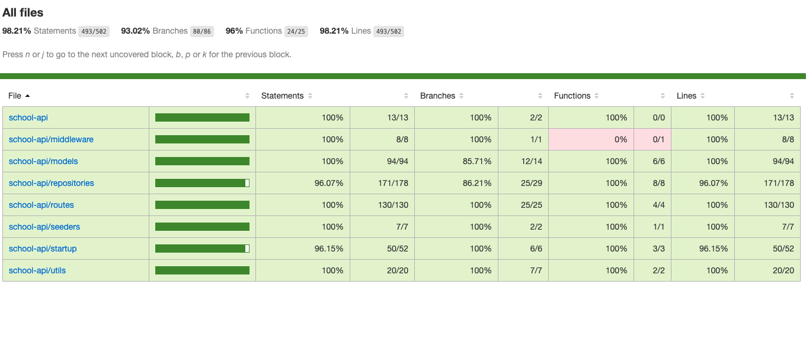

# School Api

An Api built using node.js, sequelize, javascript and mySql

## Pre-Requisite for Running Locally

- Node v12.16.1 and above installed
- MySql Server Installed (v8.0.19)

## Steps To Running Locally

- Clone the project into a working directory
- Cd to the project
- Run the following command to install node_modules

```bash
npm install
```

- Edit the config.json in the config folder, change the development section to correct parameters, for username, password, database and host
- To run locally, you need to have the schema already created in the mySql Server. E.g. if you are planning to use database = database_school_development, create that schema first manually in the server

```json
  "development": {
    "username": "root",
    "password": "Password",
    "database": "database_school_development",
    "host": "127.0.0.1",
    "dialect": "mysql",
    "operatorsAliases": 0
  },
```

- Do an initial migration / sychronisation of the database.

```bash
npm run migrate

```

- Start the application

```bash
npm start
```

- If you have nodemon installed, you can use to watch for file changes

```bash
npm run dev
```

## Test Coverage

- End to end testing using a mock sqlite3 database is done to ensure behaviour is tested instead of testing the model singular function (as the models are generated by sequelize)

- Test Coverage is as attached
  

- Run test using the command

```bash
npm run test

```

- Generate coverage report

```bash
npm run coverage-report
```

## Live-Demo

Live version has been deployed to (https://school-api-development.herokuapp.com/api)

It is connected to a free MySql server hosted elsewhere. Feel free to test it out.

To deploy to production, simply change the environment variable MYSQL_ADDON_URI
